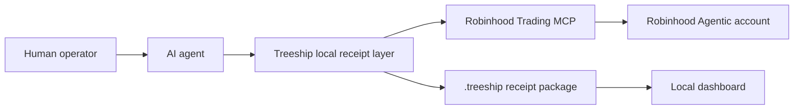

import { Callout } from 'fumadocs-ui/components/callout';
import { Steps, Step } from 'fumadocs-ui/components/steps';

Robinhood Agentic Trading lets a third-party AI agent connect to a dedicated Robinhood Agentic account through the Robinhood Trading MCP.

Treeship does not replace Robinhood, place trades, custody assets, or provide financial advice. Treeship gives the agent operator a local proof layer around the agent: what strategy was requested, what data the agent accessed, what order intent it produced, whether a human or policy approved it, and what receipt was created after the tool call.

<Callout type="warn">
Agentic trading is financially sensitive. Use this integration for evidence, policy, approvals, and auditability. Do not treat Treeship receipts as investment advice or as proof that a trade was suitable.
</Callout>

## Architecture



The separation is intentional:

| Layer | Responsibility |
|-------|----------------|
| Robinhood Trading MCP | Account connection, Robinhood auth, portfolio/account data, and order placement in the Agentic account. |
| AI agent platform | Strategy reasoning, prompts, tool selection, and MCP client runtime. |
| Treeship | Local receipts, agent identity, approval nonce binding, policy checks, session reports, and verification. |

## Connect your agent

First connect your AI platform to Robinhood's Trading MCP using Robinhood's official setup flow.

Robinhood lists the Trading MCP URL as:

```text
https://agent.robinhood.com/mcp/trading
```

Example platform setup:

```bash
# Claude Code
claude mcp add robinhood-trading --transport http https://agent.robinhood.com/mcp/trading

# Codex CLI
codex mcp add robinhood-trading --url https://agent.robinhood.com/mcp/trading
```

For Claude Desktop, ChatGPT, Codex, Cursor, and other MCP-compatible platforms, add the same Streamable HTTP MCP URL in that platform's connector or MCP settings.

<Callout type="info">
Robinhood Agentic Trading is rolling out gradually. If Robinhood has not enabled it for your account yet, the MCP connection or Agentic account onboarding may not be available.
</Callout>

## Add Treeship

Run Treeship in the workspace where the agent is being operated:

```bash
treeship init --template robinhood-agentic-trading
treeship add
treeship session start --name "robinhood agentic trading review"
```

Then run or prompt your agent from that workspace. Treeship should capture:

- The agent identity and session
- Robinhood MCP tool calls when routed through a Treeship-instrumented MCP client or supported agent integration
- Decisions and approvals you explicitly attest
- The final session report and `.treeship` proof package

Open the local control plane:

```bash
treeship dashboard
```

## Recommended proof flow

<Steps>
<Step>
### 1. Record the strategy request

Create an explicit decision artifact before the agent touches trading tools.

```bash
treeship attest decision \
  --actor agent://trading-operator \
  --summary "Evaluate whether the agent may rebalance the dedicated Agentic account under the configured risk limits." \
  --confidence 0.80
```
</Step>
<Step>
### 2. Require approval for order placement

For real order placement, issue a scoped approval and bind it to the execution step with an approval nonce.

```bash
treeship attest approval \
  --approver human://operator \
  --description "Approve one Robinhood Agentic account order under the reviewed strategy and budget."
```

Use the returned nonce only for the reviewed action.
</Step>
<Step>
### 3. Run the agent with Treeship context

Set the actor and, if applicable, the approval nonce before the MCP tool call.

```bash
export TREESHIP_ACTOR=agent://trading-agent
export TREESHIP_APPROVAL_NONCE=<nonce>
```

Then let the agent call Robinhood Trading MCP through its platform connector.
</Step>
<Step>
### 4. Close the session

```bash
treeship session close --summary "Reviewed Robinhood Agentic account activity and sealed the proof package."
```
</Step>
<Step>
### 5. Review locally

```bash
treeship dashboard
treeship package verify .treeship/sessions/<session-id>.treeship
```
</Step>
</Steps>

## Suggested policy gates

For Robinhood Agentic Trading, treat any order-placement tool as a high-risk action.

Recommended defaults:

| Tool class | Default Treeship policy |
|------------|-------------------------|
| Account and portfolio reads | Allow, but receipt the access and hash sensitive payloads. |
| Market data reads | Allow, receipt the source and timestamp. |
| Order preview or order intent | Require a decision artifact. |
| Order placement | Require human approval nonce, one use, and a max notional budget. |
| Strategy automation | Require a session-level policy and periodic review. |
| MCP connection changes | Require review, because the agent's authority boundary changes. |

## What the dashboard should show

The local dashboard should make Robinhood activity inspectable as a Treeship:

- Treeship instance: the local trading-agent workspace
- Agents: each connected agent that used the Robinhood MCP
- Receipts: every sealed session package
- Reports: human-readable summaries of trading-agent sessions
- Review queue: missing approval, failed verification, unreviewed order placement, missing model/token capture, unexpected network calls
- Agent evidence: which agent queried account data, produced strategy intent, and attempted order placement

## Implementation plan

### MVP

- Add this integration guide and blog post.
- Document setup for Claude Code, Codex CLI, Cursor, ChatGPT, and generic MCP clients.
- Use existing Treeship MCP wrapping and session receipts for local evidence.
- Add a `robinhood-agentic-trading` policy template that treats Robinhood MCP connection changes and order-placement-like commands as approval-required.

### V1

- Add a Robinhood-specific review classifier that labels MCP tools as account read, market read, order preview, or order placement.
- Surface Robinhood MCP activity in the dashboard as a dedicated capability card.
- Add receipt rendering for "trading session" sections: strategy prompt, approval, order intent, execution receipt, and post-trade review.
- Add sample agent prompts that ask for analysis without automatically placing orders.

### Later

- Add optional local watcher rules for budget, ticker allow-lists, max order count, and session time windows.
- Add team review flows where one operator proposes and another approves.
- Add Hub sharing for sanitized trading-session reports where sensitive account details are hashed or redacted.

## Security and privacy notes

Robinhood says connected agents may access account, position, balance, transaction, and order-history information, and can place trades only in the dedicated Agentic account. Treat all account data as sensitive.

Treeship should store hashes and metadata where possible, not raw portfolio details. If you export or share a report, review it for sensitive account numbers, balances, and order details first.

## Official Robinhood resources

- [Robinhood Agentic Trading overview](https://robinhood.com/us/en/support/articles/agentic-trading-overview/)
- [Robinhood Agentic Trading product page](https://robinhood.com/us/en/agentic-trading/)
